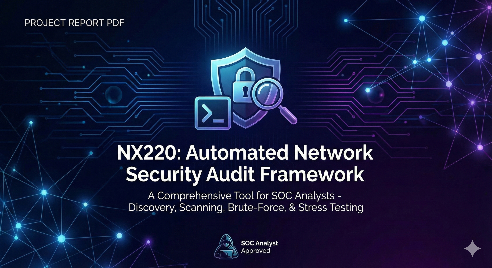

# NX220 - Automated Network Security Audit Framework



> **Role:** SOC Analyst Toolkit

---

## 📖 Executive Summary

**NX220** is an advanced Bash-based security auditing framework designed to automate the core phases of a penetration test or vulnerability assessment. It streamlines the workflow for SOC analysts by integrating multiple industry-standard tools into a unified, interactive console.

The script handles the entire lifecycle of an audit session: from dependency management and session logging to network discovery, vulnerability scanning, brute-forcing, and stress testing. It features a robust logging engine that records every action, ensuring auditability and ease of reporting.

---

## ✨ Key Features

* **🔍 Automated Network Discovery:**
    * Intelligent interface selection (detects active IPv4 interfaces).
    * Performs Ping Sweeps (`nmap -sn`) to identify live hosts in the subnet.
    * Supports single target selection, random target picking, or batch processing of all discovered hosts.

* **🛡️ Multi-Vector Vulnerability Scanning:**
    * **Fast Scan:** Rapid TCP SYN scan (Top 100 ports).
    * **Full Scan:** Comprehensive TCP scan (All 65,535 ports + OS Detection).
    * **Vuln Scan:** Targeted CVE detection using Nmap Scripting Engine (`--script vuln`).
    * **UDP Scan:** High-speed UDP flooding with `masscan`.
    * **Smart Sequence:** Automated "Deep -> Vuln -> UDP" workflow.

* **🔐 Advanced Brute-Forcing:**
    * Integrated **Hydra** and **Medusa** engines.
    * Flexible configuration: Custom user/pass lists, single credentials, or auto-fetch of **SecLists** & **RockYou**.
    * Real-time success detection ("PWNED" alerts).

* **📉 Stress Testing (DoS):**
    * TCP SYN Flood capability using `hping3` to test firewall and server resilience.

* **📊 Visualization & Logging:**
    * Custom progress bars and spinners for long-running tasks.
    * Structured session logging: `audit_summary.log` tracks all start/stop times and outcomes.
    * Clean exit strategies: Options to save artifacts, wipe traces, or debug.

---

## ⚙️ Technical Implementation

### 1. Smart Dependency Management
The script self-heals by checking for required tools (`nmap`, `hydra`, `medusa`, `hping3`, `git`, `masscan`) and auto-installing missing packages via `apt-get`. It also manages wordlists, automatically unzipping `rockyou.txt` or cloning `SecLists` if absent.

```bash
check_dependencies() {
    REQUIRED_TOOLS=("nmap" "hydra" "medusa" "hping3" ...)
    for tool in "${REQUIRED_TOOLS[@]}"; do
        if ! command -v "$tool" &> /dev/null; then
            echo -e "${BLUE}[+] Installing $tool...${NC}"
            apt-get install -y "$tool"
        fi
    done
}
2. Intelligent Target Selection
Users can dynamically select targets from the discovered network map without restarting the script.

Bash

select_target() {
    # ... (Hosts are displayed in a list)
    echo -e "${GRAY}A)${NC} Scan ALL Targets"
    echo -e "${GRAY}R)${NC} Select RANDOM Target"
    # ...
}
3. Modular Attack Engines
Each attack vector is encapsulated in its own function, allowing for clean code and modular execution.

Vulnerability Scanning: Uses a "Fast Port Discovery" first approach to identify open ports, then runs heavy scans only on those ports to save time.

Brute Force: Validates port 22 connectivity before launching attacks to prevent wasted resources.

Stress Test: Uses timeout to safely limit the duration of hping3 floods.

4. Robust Cleanup & Artifact Handling
The cleanup_and_exit function ensures no temporary files clutter the system. It offers a choice to save the session evidence or perform a complete wipe.

Bash

cleanup_and_exit() {
    echo -e "1) Save Session Logs & Artifacts"
    echo -e "2) Delete ALL Data & Exit"
    # ...
    rm -f /tmp/ports_* /tmp/clean_* /tmp/masscan_raw.txt ...
}
🚀 Usage
Prerequisites
OS: Kali Linux (Recommended) or Debian/Ubuntu.

Privileges: Root access is required (for SYN floods and raw socket access).

Quick Start
Clone or Download the script.

Make Executable:

Bash

chmod +x nx220.sh
Run as Root:

Bash

sudo ./nx220.sh
Interactive Menu
Follow the on-screen prompts to:

Name your Audit Session.

Select your Network Interface.

Choose a Target (or all targets).

Select an Attack Vector (Scan, Brute Force, DoS, or All).

📂 Session Structure
Logs are stored in /var/log/NX220/ by default.

Plaintext

/var/log/NX220/
└── Session_Name/
    ├── audit_summary.log       # Master timeline of events
    ├── discovered_hosts.txt    # Network map
    ├── scans/                  # Nmap/Masscan output files
    ├── brute_force/            # Hydra/Medusa credential logs
    └── stress_tests/           # Hping3 flood logs
⚠️ Disclaimer
This tool is created for educational purposes and authorized security auditing only. Unauthorized use against systems you do not own or have explicit permission to test is illegal. The author is not responsible for misuse.
